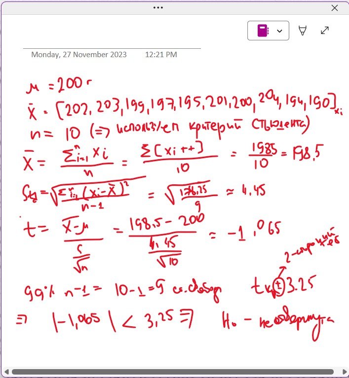

# task3

Для проверки Hsub0 гипотезы о весе печенья  = 200г можно воспользоваться  проверкой гипотез с использованием t-статистики (с использованием критерия Стьюдента), т.к. размер выборки недостаточно большой (n=10).

