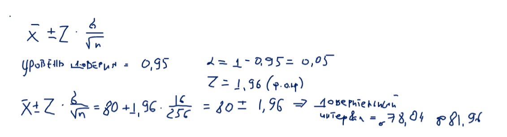

# task1

Известно, что генеральная совокупность распределена нормально со средним квадратическим отклонением, равным 16. Найти доверительный интервал для оценки математического ожидания a с надежностью 0.95, если выборочная средняя M = 80, а объем выборки n = 256.

Xmean- выборочное среднее
σ - известное стандартное отклонение генеральной совокупности
n - объем выборки
Z - значение стандартного нормального распределения для уровня доверия − 1−α

